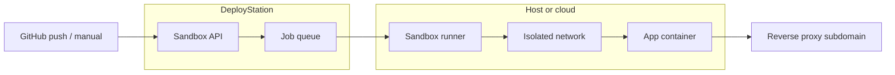

# Sandbox VM Plan (Future)

DeployStation may offer **ephemeral preview environments**: a short-lived VM or container namespace where a branch build runs in isolation before promotion to production.

## Goals

- Let builders open a **preview URL** for a branch or portable export without touching production routes.
- Auto-expire sandboxes after TTL (e.g. 24 hours) to control cost.
- Reuse the same Docker compose definitions as production, with sandbox-only env vars.

## Non-goals (v1)

- Full desktop VM per user
- Arbitrary outbound network from sandboxes (restrict by default)
- Long-term data retention in sandboxes

## Proposed architecture



1. **Trigger** — Manual “Preview” button, GitHub webhook, or portable import.
2. **Provision** — Runner creates network + `docker compose -f docker-compose.deploy.yml up` with unique project slug `preview-{id}`.
3. **Route** — Nginx/Caddy maps `preview-{id}.example.com` → container port (same pattern as `/p/{slug}/` today).
4. **Teardown** — Cron or worker destroys containers and volumes when TTL elapses.

## Data model (sketch)

```json
{
  "id": "prev_abc123",
  "project": "my-app",
  "ref": "feature/checkout",
  "imageTag": "my-app:prev_abc123",
  "url": "https://prev-abc123.previews.example.com",
  "createdAt": "2026-05-15T12:00:00Z",
  "expiresAt": "2026-05-16T12:00:00Z",
  "status": "running"
}
```

Store under `STATION_DATA_DIR/sandboxes/` until a proper queue DB exists.

## Security

- Sandboxes run on an **internal Docker network**; only the reverse proxy publishes HTTP.
- Secrets from production must not be copied; use `.env.sandbox` generated per preview.
- Resource limits: CPU/memory caps via `deploy.resources` in compose.
- No host Docker socket inside app containers.

## Implementation phases

| Phase | Deliverable |
|-------|-------------|
| 0 | Document only (this file) |
| 1 | Manual preview: clone project → `docker compose up` on secondary port, link from project settings |
| 2 | Subdomain routing + TTL cron destroy |
| 3 | GitHub branch webhooks → automatic preview |
| 4 | Optional Firecracker/QEMU VM per preview for stronger isolation (hosting-dependent) |

## Dependencies

- Stable portable export and template scaffold (done)
- Job queue or background worker (not started)
- Host DNS wildcard `*.previews.example.com` (operator responsibility)

## Open questions

- Single-host previews vs. delegate to cloud (Fly.io, ECS task, etc.)
- Whether previews share databases or use disposable SQLite/empty MySQL
- Builder-only vs. viewer read-only preview URLs

When Phase 1 begins, add `lib/sandbox.php` and `sandbox-actions.php` following the same patterns as `lib/docker.php` and `docker-actions.php`.
